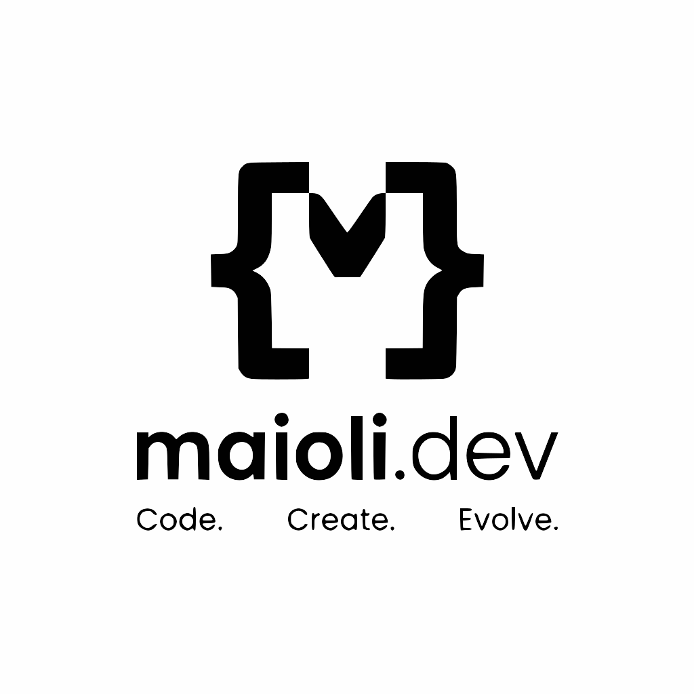

<div align="center">
  

  <h1>maioli.dev.br</h1>

  <p>
    <strong>Multilingual portfolio for the maioli.dev software company, with interactive Marvel-themed visuals and effects.</strong>
  </p>

  <p>
    🌍 <a href="README.md">English</a> |
    🇧🇷 <a href="README.pt-BR.md">Português</a> |
    🇪🇸 <a href="README.es-LA.md">Español</a>
  </p>

  <p>
    
    
    
    
  </p>

  <p align="center">
    <a href="https://maioli.dev.br" target="_blank">
      
    </a>
  </p>
</div>

---

## 📖 Overview

**maioli.dev.br** is the official portfolio of the **maioli.dev** software development company. It presents the team's projects and trajectory across three locales — `pt-BR`, `en-US` and `es-LA` — with editorial content maintained in Markdown/MDX and a playful interface inspired by Marvel heroes and villains. The site runs on **Next.js** (App Router) and ships as a fully deployable application on Vercel.

## ✨ Key Features

- **🎨 Marvel-themed capsules:** 20 switchable themes (Universe, Spider-Man, Iron Man, Captain America, Thor, Hulk, ...) with primary/secondary palettes, an active-state checkmark (`✓`) placed to the right of a centered label without shifting the capsule, and contrast-safe fallbacks.
- **🦹 Chaos Engine effects:** interactive Thanos snap, Loki rotation, Doctor Doom fog and Magneto wave effects driven by a lightweight event emitter — kept visually stable for the active theme.
- **🌍 Trilingual i18n:** complete UI dictionaries for `pt-BR`, `en-US` and `es-LA`, plus equivalent routes and localized content for every page.
- **📝 MDX-driven content:** projects and the "About" section are Markdown/MDX files validated at build time with **Zod** (fail-fast on invalid frontmatter).
- **🤖 Automated E2E testing:** Playwright suites covering the showcase, the About section and the Chaos Engine effects (theme stability, contrast and persistence included).

## 🏗️ Architecture & Tech Stack

The project is a single Next.js application structured to keep **content separated from code** and **effects isolated from layout**.

### 📁 Project Structure

```text
maioli.dev.br/
├── content/
│   ├── about/      # Localized institutional content (who we are, mission)
│   └── projects/   # Localized project content per locale
├── e2e/            # Playwright end-to-end tests
├── public/         # Static images and assets
├── scripts/        # Dev server + content validation scripts
└── src/
    ├── app/        # App Router pages, layouts, proxy and global styles
    ├── components/ # UI, layout, about, projects and visual-effect components
    ├── hooks/      # Shared React hooks
    ├── i18n/       # Locale configuration and UI dictionaries
    └── lib/        # Content loaders, Zod schemas, themes and chaos events
```

### 🛠️ Technology Stack

- **Frontend:** Next.js 16 (App Router), React 19, TypeScript 5, Tailwind CSS 4, Framer Motion 13.
- **Content:** gray-matter, next-mdx-remote, Zod 4 (frontmatter validation).
- **Testing:** Playwright (Chromium).
- **Tooling:** ESLint 9 + `eslint-config-next`, `kill-port` dev script.

## 🚀 Getting Started

### Prerequisites

- Node.js 20 or higher.
- npm.

### Installation

1. Clone the repository:
   ```bash
   git clone https://github.com/immaioli/maioli.dev.br.git
   cd maioli.dev.br
   ```

2. Install dependencies:
   ```bash
   npm install
   ```

### Running the Project

**Start the development server (frees port 3000 first):**
```bash
npm run dev
```
The app is available at `http://localhost:3000/pt-BR/`.

**Production build and start:**
```bash
npm run build
npm run start
```

### Running Validation and E2E Tests

```bash
npm run validate:content   # validates MDX/MDX frontmatter with Zod
npm run lint               # runs ESLint
npm run build              # production build
npx playwright test        # E2E tests on Chromium
```

## ⚙️ Environment Variables

No secrets or environment variables are required. The app reads all content from the repository and works out of the box.

## 🧠 Architectural Decisions

*   **Why Next.js App Router + content in MDX?** Routes are statically generated per locale (`generateStaticParams`), which keeps the site fast and deployable on Vercel while content stays editable in plain files — no CMS or database to maintain.
*   **Why fail-fast with Zod?** Frontmatter is validated both by `validate:content` and at load time, so an invalid file aborts the build instead of shipping a broken page.
*   **Why primary/secondary theme pairs?** Every capsule uses a distinct primary + secondary color to remain identifiable by color alone, but the active state adds a `✓` indicator and an outline so it does not rely on color as the only cue.
*   **Why a centered label with a reserved column for the checkmark?** The checkmark lives in a fixed `1em` column (spacer on the left, `✓` on the right), so switching the active theme never shifts the label or changes the capsule width.

## 🤝 Contributing

1. Fork the Project.
2. Create your Feature Branch (`git checkout -b feature/AmazingFeature`).
3. Commit your Changes (`git commit -m 'Add some AmazingFeature'`).
4. Push to the Branch (`git push origin feature/AmazingFeature`).
5. Open a Pull Request. Ensure all Playwright tests pass and Clean Code principles are strictly followed.

## 📜 License

Distributed under the MIT License. See `LICENSE` for more information.
